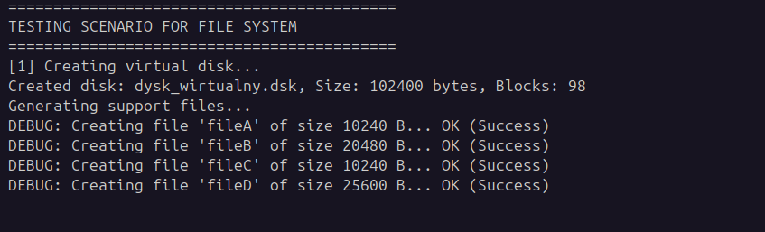
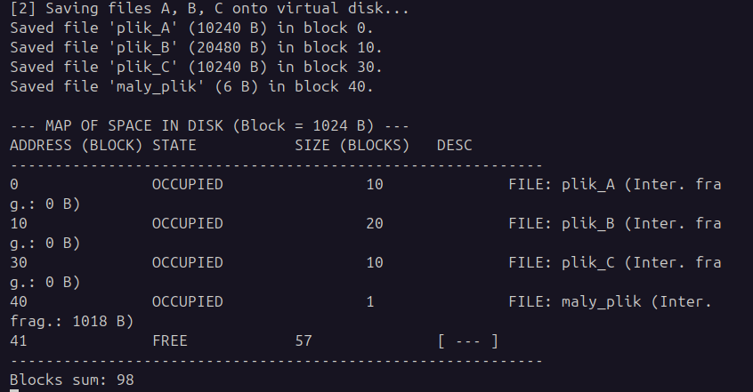
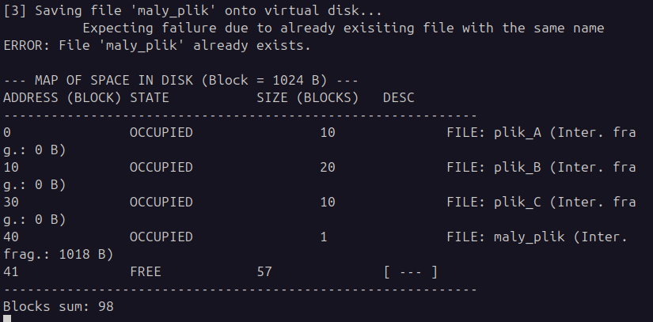
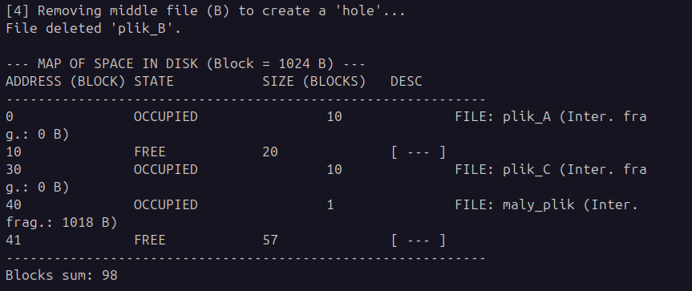
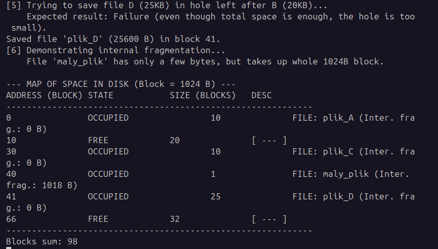
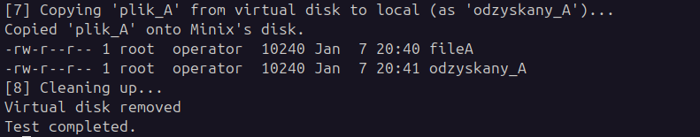

# SOI Zadanie 6 - system plików
# Raport autorstwa Kacpra Skrodzkiego

## Wstęp - założenia systemu plików

W ramach szóstego zadania należało zaimplementować w środowisku systemu MINIX w języku system plików z jednopoziomowym katalogiem. W ramach implementacji należało wprowadzić możliwość utworzenia i kasowania wirtualnego dysku, kopiowania plików do i z dysku wirtualnego, usuwania plików z dysku oraz przestrzeganie ram dostępnego miejsca.

## Implementacja - ogólna charakterystka

W super bloku są przechowywane informacje o tym, jaki jest całkowity rozmiar dysku, ile jest bloków pamięci oraz lista wszystkich pozycji w katalogu. Na danej pozycji są przechowywane informacje o nazwie przechowywanego pliku, rozmiarze zapisanych danych, ilości zajmowanych bloków pamięci oraz flaga _used_ służąca do określenia, czy dana pozycja w katalogu jest okupowana czy nie.

W ramach mojej implementacji dysk wirtualny ma pojemność 100 KB, z blokiem pamięci równym 1 KB oraz maksymalnej liczbie 32 plików w katalogu. Dodatkowo pamięć jest alokowana w sposób ciągły, używając algorytmu _First Fit_ do wyszukania odpowiedniego miejsca dla danych.

## Implementacja - funckjonalności

Głównymi funkcjami w zaimplementowanym systemie plików są __copy_to_virtual()__ i __copy_from_virtual()__, pozwalające na kopiowanie plików pomiędzy lokalnym dyskiem a dyskiem wirtualnym, __create_disk()__ i __remove_disk()__, które inicjalizują i usuwają dysk wirtualny, __delete_entry()__, odpowiadające za usuwanie plików z dysku oraz __show_map()__ listujące zawartość dysku z rozmieszczeniem zapisanych plików w pamięci.

### copy_to_virtual() oraz copy_from_virtual()

Jest to najbardziej skomplikowana funkcja ze względu na zachowanie bezpieczeństwa danych na fizycznym dysku. W czasie próby kopiowania pliku z dysku lokalnego na dysk wirtualny jest sprawdzane, czy nie ma już zapisanego pliku o takiej samej nazwie na dysku, czy plik źródłowy w ogóle istnieje, czy jest miejsce w katalogu, a potem fizycznie na dysku. Jeśli wszystkie warunki będą spełnione to dopiero wtedy dokonuje się kopiowanie danych.

W przypadku operacji kopiowania pliku na dysk lokalny jest tylko sprawdzane, czy plik który chcemy skopiować w ogóle istnieje.

## Problem fragmentacji - zewnętrznej oraz wewnętrznej

Jednym z mankamentów tego systemu plików jest problem fragmentacji danych w przestrzeni adresowej. Problem ten pojawia się na dwóch płaszczyznach - na zewnętrznym, fizycznym nośniku danych oraz w wewnętrznej strukturze dysku wirtualnego.

Zapisane pliki niekoniecznie muszą być zapisane obok siebie na fizycznym nośniku. Wynika to z faktu, że system operacyjny potrafi poszatkować miejsce przydzielone dyskowi wirtualnemu. Rodzi to lekkie komplikacje w mapowaniu zawartości dysku wirtualnego, ale nie jest to duży problem.

Innym problemem, który ma realny wpływ na wykorzystanie dostępnej przestrzeni adresowej jest wewnętrzna fragmentacja pamięci. Małe pliki (parę bajtów w rozmiarze) mogą zająć cały blok danych (1024 B), co jest strasznie nieefektywne. Potencjalnym rozwiązaniem mogłoby być zmniejszenie rozmiaru bloków pamięci z 1024 B do bodajże 4 B. Jednakże nie jest to rozwiązanie idealne, bo nadal jest jeszcze niewykorzystane miejsce, gdzie przy tym zwiększamy możliwe ilości komórek adresowalnych w pamięci, wydłużając czas dostępu do zasobów.

## Testy implementacji

W ramach przetestowania działania systemu plików napisałem skrypt w shellu __test.sh__ testujący pokolei następujące elementy:
    * utworzenie dysku wirtualnego
    * utworzenie paru plików o różnych rozmiarach
    * kopiowanie każdego z nich na dysk
    * próba ponownego skopiowania pliku, który już jest na dysku
    * usunięcie pliku, tworząc dziurę na dysku
    * próba zapisu zbyt dużego pliku na miejsce usuniętego (fragmentacja pamięci)
    * skopiowanie pliku z dysku wirtualnego na dysk lokalny
    * usunięcię dysku wirtualnego

W celu utworzenia plików testowych napisałem program w C, który tworzy plik o podanej nazwie i rozmiarze, zapełniając go zerami. Rozwiązanie z komendą _dd if=/dev/null ..._ nie działa na MINIX-e.

## Podsumowanie

Jak widać z załączonych wyżej zdjęć, wszystkie testy przeszły pomyślnie. Nie doszło do duplikacji plików, kopiowania przeszły pomyślnie oraz alokacja w pamięci odbyła się prawidłowo. Prosty system plików został pomyślnie zaimplementowany.