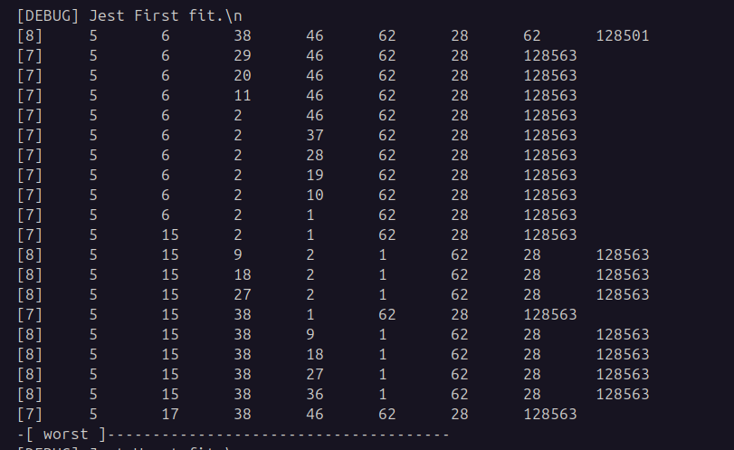
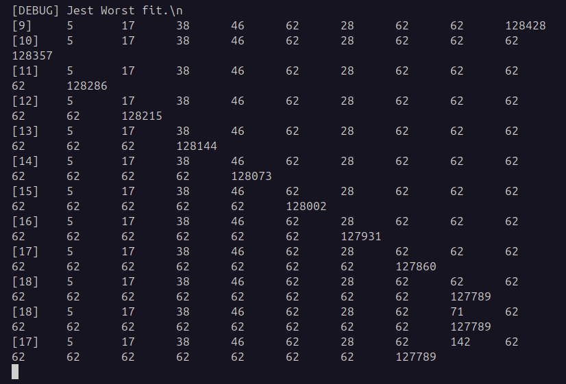
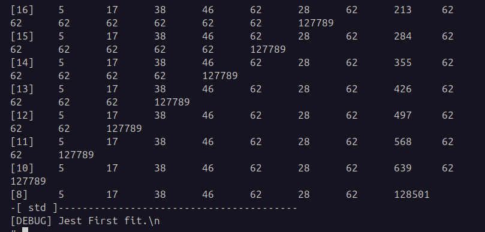

# SOI Zadanie 5 - Zarządzanie pamięcią
# Raport autorstwa Kacpra Skrodzkiego

## Wstęp

W ramach piątego zadania należało zaimplementować algorytm worst fit do przydziału pamięci w systemie MINIX, zademonstrować i zinterpretować różnicę w działaniu worst fit a domyślnym first fit.

W celu demonstracji różnic, wykorzystałem skrypt sh udostępniony w materiałach do laboratoriów.

## First Fit - analiza

### Wnioski:

Na powższym obrazku jest zademonstrowany stan listy wolnych bloków pamięci - liczba i ich rozmiar, w czasie działania testu dla First Fit. Dla pierwszych 10 logów jest brany stan listy, gdy w tle działa program __x.c__, który ma zająć część bloków. Następne 10 logów opisują stan pamięci po skończeniu programu.

W liście dziur możemy zauważyć charakterystkę algorytmu First Fit. Algorytm przydziela pierwszy pasujący blok pamięci do zapotrzebowań procesu. Z tego powodu powstaje wiele dziur o małych pojemnościach na początku listy, gdzie na końcu blok o największej pojemności jest ledwo co zmieniany. Taka alokacja pamięci jest bardzo szybka, gdyż statystycznie w małych odprsykach znajduje odpowiedni blok bardzo szybko.

## Worst Fit - analiza

### Wnioski:

Na powższym obrazku jest zademonstrowany stan listy wolnych bloków pamięci - liczba i ich rozmiar, w czasie działania testu dla Worst Fit. Dla pierwszych 10 logów jest brany stan listy, gdy w tle działa program __x.c__, który ma zająć część bloków. Następne 10 logów opisują stan pamięci po skończeniu programu.

W liście dziur zauważamy sporą zmianę w porównaniu z algorytmem First Fit. Algorytm Worst Fit priorytezuje te bloki pamięci, które mają największą pojemność ze wszystkich bloków. Co za tym idzie, wraz z działaniem procesu powstaje wiele mniejszych bloków pamięci o zbliżonej pojemności, a pojemność największych dziur powowli się zmniejsza. Wraz z zakończeniem pracy programu __x.c__ dziury "oderwane" od największego bloku łączą się z nim i przywracają podobny stan listy jak na początku testu tego segmentu.

Worst Fit w swoim działaniu tworzy wiele dziur o "uśrednionym" rozmiarze stworzonych z "odrywania" kawałków największych dziur. W teorii te zachowanie ma zapobiegać tworzenie małych, bezużytecznych dziur. Jednakże w praktyce narasta nowy problem, gdyż może dojść do sytuacji, gdzie nie będzie odpowiednio dużego bloku pamięci dla danego procesu, bo duże bloki zostały "nadgryzione".

## Podsumowanie

Algorytmy First Fit i Worst Fit mają swoje zalety i wady. Każdy skupia się na innym aspekcie alokacji pamięci. Jednakże po analizie obu rozwiązań dochodzę do konkluzji, że algorytm First Fit jest bardziej wydajny niż Worst Fit. Może pierwszy algorytm tworzy wiele małych, bezużytecznych dziur, ale za to ma większe prawdopodobieństwo, że alokacja przebiegnie pomyślnie dla dużych procesów oraz sam proces alokacji jest statystycznie szybszy.
